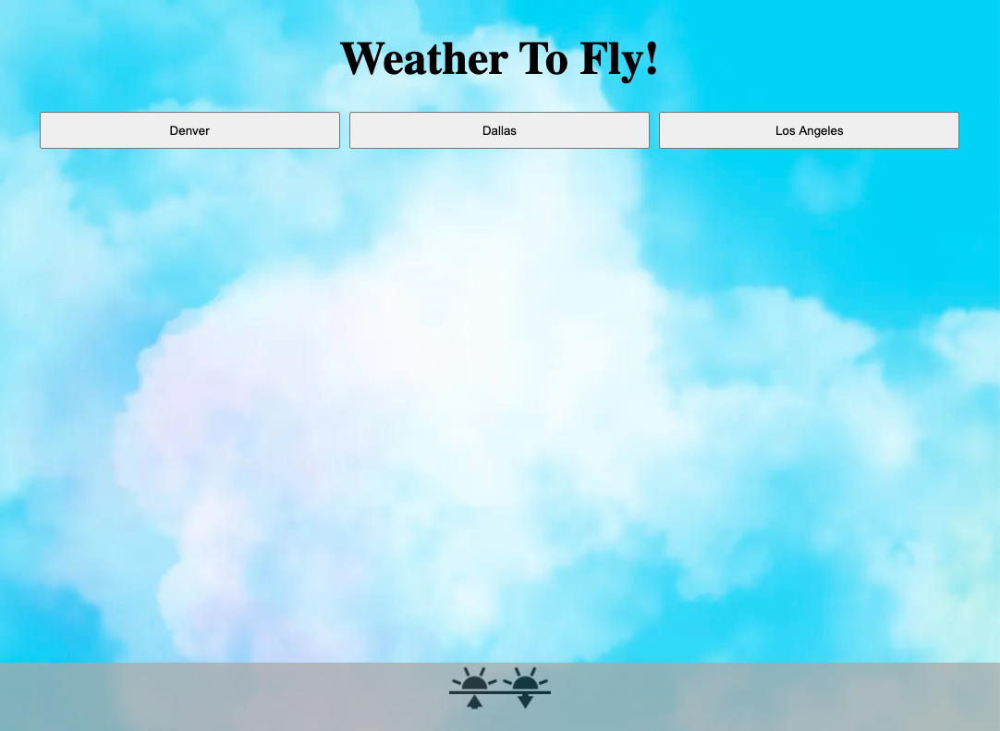
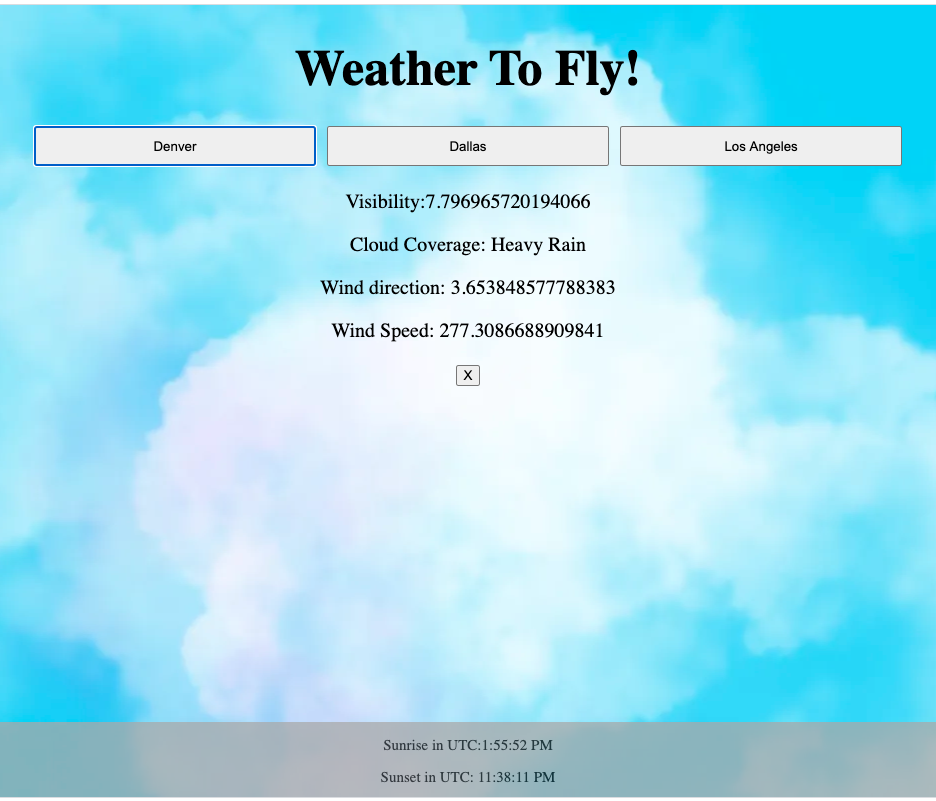
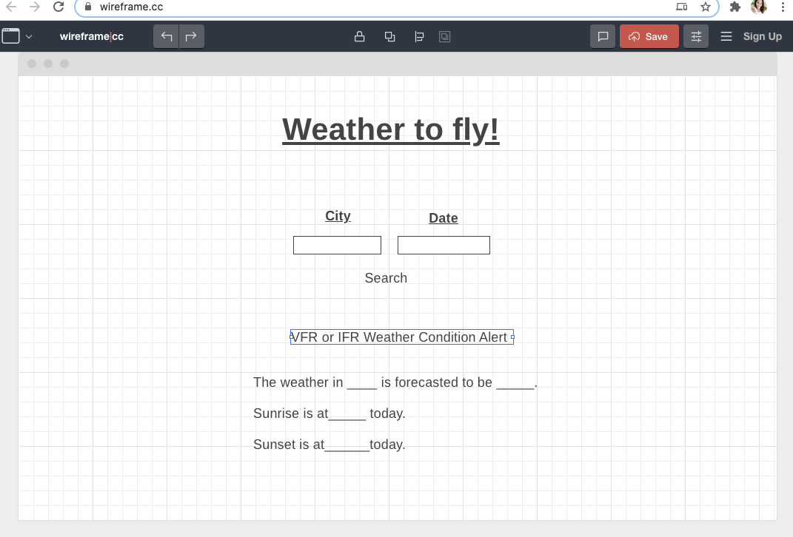
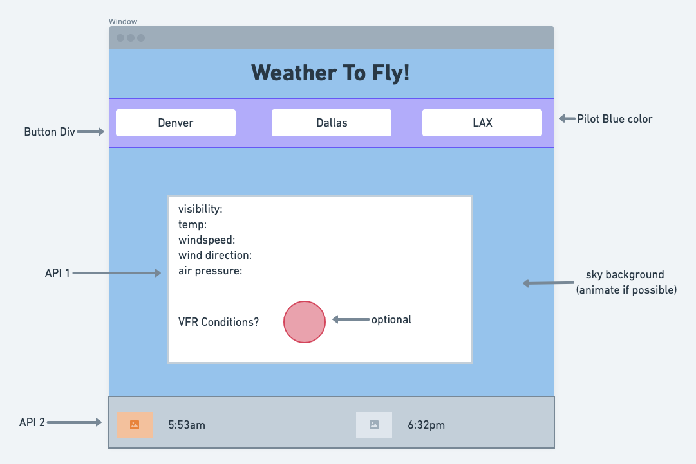
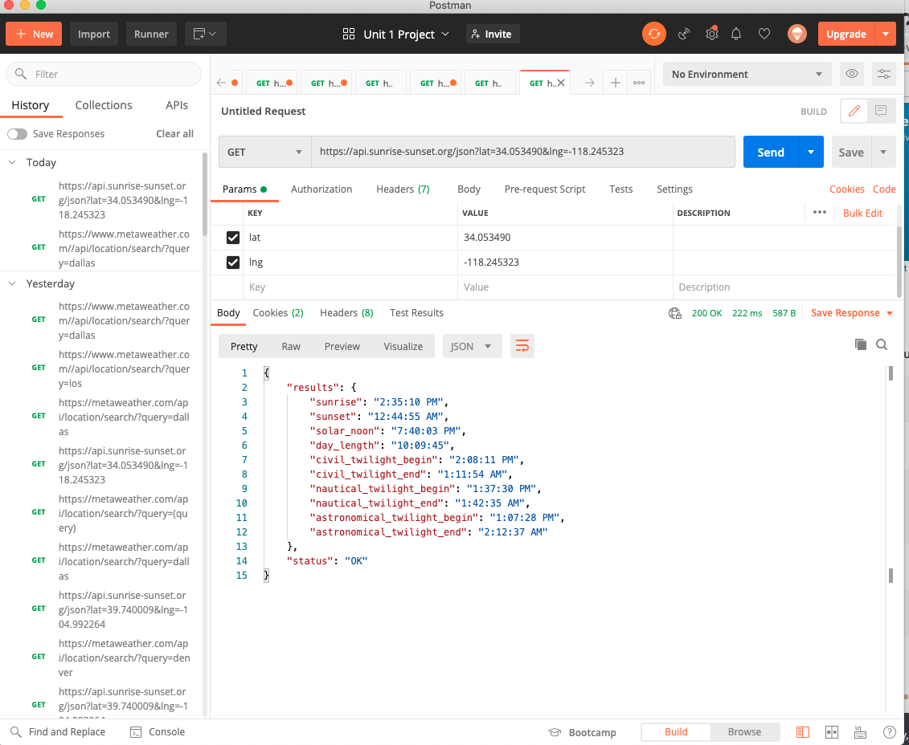
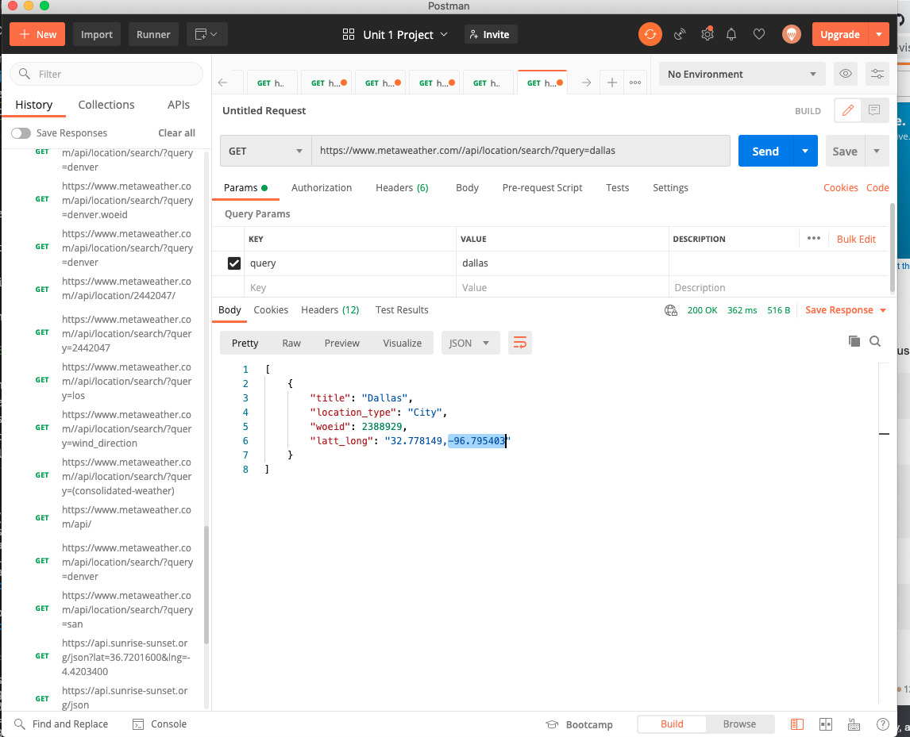

# Unit-One-Project

### Getting Started:

[Weather to Fly!](http://weather_to_fly_app.surge.sh/)

This app is a quick reference point for pilots to check the weather in their area and verify the sunrise and sunset times in their area. This will help them to determine if the conditions are safe for Visual Flight Rules.

#### Deployed App: 

### Biggest Challenges

My app/site was originally supposed to have 2 input buttons that would allow the user to input their city and the date they desire, however; I struggled immensly with the weather API. Between using outside servers to get around CORS and extracting the specific data I desired I decided to change my plan. Each city in this API has a specific and random id number that would have made it difficult to translate, so I hard coded the city's specific API code and limited this project to only pulling data from a few locations. 

#### Original Wireframe

#### Second Wireframe:

#### Sunrise API In Postman

#### Weather API in Postman

### Technologies Used:

* HTML
* CSS
* JavaScript
* Wireframe CC
* Whimsical
* Postman
* Heroku
* [Meta Weather API](https://www.metaweather.com/api/)
* [Sunrise Sunset API](https://sunrise-sunset.org/api)
* [GitHub](https://github.com/Looloo414/unit-one-project)

### Pseudocode

1. Connect all cached element references: buttons and div and footers where data will be appended. 
2. Pull APIs into code.
   ---->Call fetch api(json)
   ---->Response, promise, async, await second API
   ---->Complete and grab data from body of response
   ---->Make element with the data
   ---->Handle errors
3. Create event listners for each button and have it pull the promised API's and append the weather to the div and the sunrise and sunset data to the footer. 
4. Since the API's are being fetched through another server and it is fetching 2 API's create a message to allow the user to know that their click is doing something and to please wait. 
5. Create a delete function so that the appended/fetched data does not keep pushing into the array and displaying multiple fetch requests. 

### Next Steps

I plan to debug the issues concerining the "WOEID" in the weather API, so that I can create input bars for the user to enter their own city and their desired dates. I also want to add a stylistic function to display whether the current conditions in the user's area are safe for VFR flight or not. I want to play with the animations and style features more as well. I would like to have an airplane fly across the screen and a green light illuminates showing that the conditions are within VFR limitations or a grounded plane and a red light will display if they are not. 

I would also like to add a mathfloor function to the data that is displayed so it is more readable and I would like to figure out a way to convert the time into local time for the city that is selected. 

